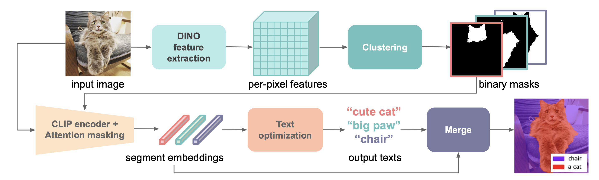

# Zero-guidance Segmentation
Official Pytorch Implementation of Zero-guidance Segmentation Using Zero Segment Labels


A ICCV 2023 paper ([paper](https://openaccess.thecvf.com/content/ICCV2023/papers/Rewatbowornwong_Zero-guidance_Segmentation_Using_Zero_Segment_Labels_ICCV_2023_paper.pdf), [site](https://zero-guide-seg.github.io/), [5-min video](https://www.youtube.com/watch?v=sIK3ExE0HnU)):


```
@inproceedings{preechakul2021diffusion,
      title={Diffusion Autoencoders: Toward a Meaningful and Decodable Representation}, 
      author={Preechakul, Konpat and Chatthee, Nattanat and Wizadwongsa, Suttisak and Suwajanakorn, Supasorn},
      booktitle={IEEE Conference on Computer Vision and Pattern Recognition (CVPR)}, 
      year={2022},
}
```


### Overall Pipeline

<br>

<br>


### Output Examples
<br>

<br>


## Run Zero Guidance Segmentation 
We provide example scripts for each stage
### DINO Clustering
```bash run_dino_clustering.sh ```
### Text Optimization and Merging
```bash run_zeroguidance.sh```
### Evaluate Results
```bash run_eval.sh```


```
